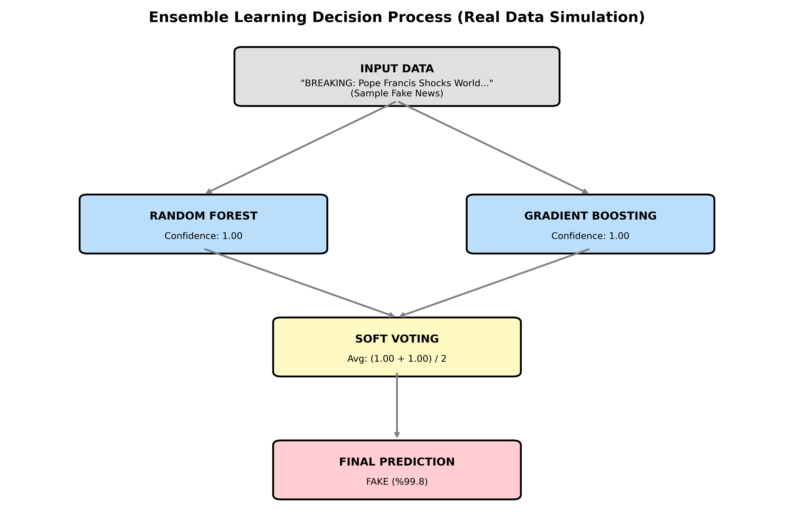

# 📰 Fake News Detector

Sahte haber tespiti için geliştirilmiş makine öğrenmesi projesi. Ensemble model mimarisi kullanan bu uygulama, bir haber metninin gerçek mi yoksa sahte mi olduğunu tahmin eder.

## 🚀 Özellikler

- **Ensemble ML Modeli**: Birden fazla sınıflandırıcının birleştirilmesiyle yüksek doğruluk
- **TF-IDF Vektörizasyon**: Metin verilerinin sayısal temsili
- **Flask Web Arayüzü**: Kullanıcı dostu web uygulaması (`app.py`)
- **Jupyter Analizi**: Detaylı model eğitimi ve görselleştirme (`main.ipynb`)

## 📊 Kullanılan Veri Seti

ISOT Fake News Dataset — gerçek ve sahte haberlerden oluşan dengeli veri seti.

## 🛠️ Kurulum

```bash
pip install -r requirements.txt
python app.py
```

## 📈 Model Mimarisi



## 🔧 Teknolojiler

- Python, Scikit-learn, Flask
- TF-IDF, Ensemble Learning
- Pandas, NumPy, Matplotlib
